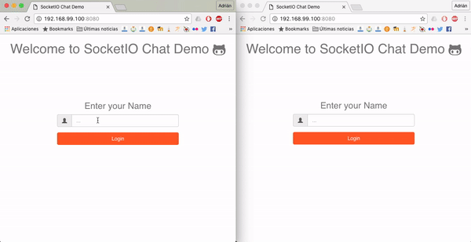

# docker-chat

Dockerized chat, based on my previous project [SocketIOChatDemo], which is an example of a web application using *[socket.io]* library.


Following the [Microservices architecture], the system consists on two services that run in separate containers:

+ Web service: [node.js] server. Using the official [node image].
+ Database service: [MongoDB] database. Using he official [mongo image].


## Demo



## Usage

```groovy
$ git clone https://github.com/ageapps/docker-chat
$ cd docker-chat
$ docker-compose up
// connect in your browser to <host IP>:8080
```

## Resources
+ [Docker]: Software containerization platform
+ [SocketIOChatDemo]: Chat web application.
+ [node.js]: Server enviroment.
+ [MongoDB]: NoSQL database system.
+ [mongoose]: MongoDB object modeling for *node.js*.
+ [docker-build]: Automated build of *Docker* images.
+ [docker-compose]: Automated configuration and run of multi-container *Docker* applications.


[Microservices architecture]: http://microservices.io/patterns/microservices.html
[SocketIOChatDemo]: https://github.com/ageapps/SocketIOChatDemo.git
[node image]: https://hub.docker.com/_/node/
[mongo image]: https://hub.docker.com/_/mongo/
[MongoDB]: https://www.mongodb.com
[mongoose]: http://mongoosejs.com/index.html
[node.js]: http://nodejs.org
[Docker]: https://docs.docker.com/
[docker-compose]:https://docs.docker.com/compose/compose-file/
[docker-build]:https://docs.docker.com/engine/reference/builder/
